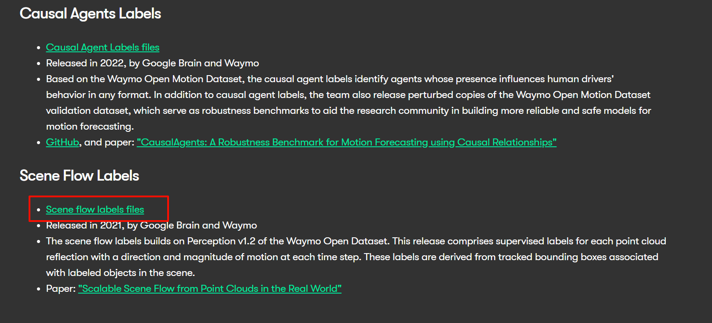

# Preparing Waymo Dataset
## 1. Register on Waymo Open Dataset

#### Sign Up for a Waymo Open Dataset Account and Install gcloud SDK

To download the Waymo dataset, you need to register an account at [Waymo Open Dataset](https://waymo.com/open/). You also need to install gcloud SDK and authenticate your account. Please refer to [this page](https://cloud.google.com/sdk/docs/install) for more details.

#### Set Up the Data Directory

Once you've registered and installed the gcloud SDK, create a directory to house the raw data:

```shell
# Create the data directory or create a symbolic link to the data directory
mkdir -p ./data/waymo/raw   
mkdir -p ./data/waymo/processed 
```

## 2. Download the raw data
For the Waymo Open Dataset, we first organize the scene names alphabetically and store them in `data/waymo_train_list.txt`. The scene index is then determined by the line number minus one.

For example, to obtain the 23th, 114th, and 788th scenes from the Waymo Open Dataset, execute:

```shell
python datasets/waymo/waymo_download.py \
    --target_dir ./data/waymo/raw \
    --scene_ids 23 114 327 621 703 172 552 788
```

You can also provide a split file (e.g. `data/waymo_example_scenes.txt`) to download a batch of scenes at once:

```shell
python datasets/waymo/waymo_download.py \
    --target_dir ./data/waymo/raw \
    --split_file data/waymo_example_scenes.txt
```

If you wish to run experiments on different scenes, please specify your own list of scenes.

If this script doesn't work due to network issues, also consider manual download:
Download the [scene flow version](https://console.cloud.google.com/storage/browser/waymo_open_dataset_scene_flow;tab=objects?prefix=&forceOnObjectsSortingFiltering=false&inv=1&invt=Abx3TQ) of Waymo.



## 3. Preprocess the data
After downloading the raw dataset, you'll need to preprocess this compressed data to extract and organize various components.

#### Install Waymo Development Toolkit
```shell
pip install waymo-open-dataset-tf-2-11-0==1.6.0
```

#### Running the preprocessing script
To preprocess specific scenes of the dataset, use the following command:
```shell
# export PYTHONPATH=\path\to\project
python datasets/preprocess.py \
    --data_root data/waymo/raw/ \
    --target_dir data/waymo/processed \
    --dataset waymo \
    --split training \
    --scene_ids 23 114 327 621 703 172 552 788 \
    --workers 8 \
    --process_keys images lidar calib pose dynamic_masks objects
```
Alternatively, preprocess a batch of scenes by providing the split file:
```shell
# export PYTHONPATH=\path\to\project
python datasets/preprocess.py \
    --data_root data/waymo/raw/ \
    --target_dir data/waymo/processed \
    --dataset waymo \
    --split training \
    --split_file data/waymo_example_scenes.txt \
    --workers 8 \
    --process_keys images lidar calib pose dynamic_masks objects
```
The extracted data will be stored in the `data/waymo/processed` directory.

## 4. Extract Masks
To generate:

- **sky masks (required)** 
- fine dynamic masks (optional)
Follow these steps:

#### Install `Mask2former` 

```shell
#-- Set conda env
conda create -n mask2former python=3.10
conda activate mask2former

# Install PyTorch 
# Reference install.md Download PyTorch and vLLM from MetaX Developer Center
# pip install torch
pip install mmcv==2.0.0 -f https://download.openmmlab.com/mmcv/dist/cu116/torch2.0.0/index.html
pip install mmdet==3.3.0
pip install mmengine==0.10.7
pip install mmsegmentation==1.2.2
pip install timm==0.5.4
pip install numpy==1.23.1
pip install ftfy regex imageio
# get mask2former config file
cd ./third_party/
git clone https://github.com/open-mmlab/mmsegmentation.git
# get pretrain weigth
cd mmsegmentation
wget https://download.openmmlab.com/mmsegmentation/v0.5/mask2former/mask2former_swin-l-in22k-384x384-pre_8xb2-90k_cityscapes-512x1024/mask2former_swin-l-in22k-384x384-pre_8xb2-90k_cityscapes-512x1024_20221202_141901-28ad20f1.pth
```
Remember the location where you download into, and pass it to the script in the next step with --checkpoint .

#### Run Mask Extraction Script
```shell
conda activate mask2former
mask2former_path=/pathtomask2former

# export PYTHONPATH=\path\to\project
cd /path/to/project
python datasets/tools/extract_masks.py \
    --data_root data/waymo/processed/training \
    --config=$mask2former_path/mask2former_swin-l-in22k-384x384-pre_8xb2-90k_cityscapes-512x1024.py \
    --checkpoint= mask2former_swin-l-in22k-384x384-pre_8xb2-90k_cityscapes-512x1024_20221202_141901-28ad20f1.pth \
    --split_file data/waymo_example_scenes_self.txt \
    --process_dynamic_mask
```
Replace `/mask2former_path` with the actual path to your mask2former path. such as: /third_party/mmsegmentation/configs/mask2former

Note: The `--process_dynamic_mask` flag is included to process fine dynamic masks along with sky masks.
This process will extract the required masks from your processed data.


## 5. Human Body Pose Processing

SMPL-Nodes (SMPL Gaussian Representation) requires Human Body Pose Sequences of pedestrians. We've developed a human body pose processing pipeline for in-the-wild driving data to generate this information. There are two ways to obtain these data:

#### Option 1: Download Preprocessed Human Pose Data

We have uploaded preprocessed human pose data for a subset of Waymo scenes to [Google Drive](https://drive.google.com/drive/folders/187w1rwEZ5i9tb4y-dOJVTnIZAtKPR7_j). You can download and unzip these files without installing any additional environment.

```shell
# https://drive.google.com/file/d/1QrtMrPAQhfSABpfgQWJZA2o_DDamL_7_/view?usp=drive_link
# filename: waymo_preprocess_humanpose.zip
cd data
gdown 1QrtMrPAQhfSABpfgQWJZA2o_DDamL_7_ 

unzip waymo_preprocess_humanpose.zip
rm waymo_preprocess_humanpose.zip
```

#### Option 2: Run the Extraction Pipeline

To process human body poses for other Waymo scenes or to run the processing pipeline yourself, follow the instructions.
#### Prerequisites
warning: To utilize the SMPL-Gaussians to model pedestrians, please first download the SMPL models.

1. Download SMPL v1.1 (`SMPL_python_v.1.1.0.zip`) from the [SMPL official website](https://smpl.is.tue.mpg.de/download.php)
2. Move `SMPL_python_v.1.1.0/smpl/models/basicmodel_neutral_lbs_10_207_0_v1.1.0.pkl` to ` ~/.cache/phalp/3D/models/smpl/SMPL_NEUTRAL.pkl`

**1. Update submodules and set up the environment:**
   ```bash
   # Update submodules
   git submodule update --init --recursive

   # Create and activate the environment
   conda create --name 4D-humans python=3.10 -y
   conda activate 4D-humans

   # Install PyTorch 
   # Reference install.md Download PyTorch and vLLM from MetaX Developer Center
   # pip install torch

   # Install 4D-Humans
   cd third_party/Humans4D
   # Alter for C500 support 
   # 1. hmr2/models/hmr2.py line 20 def __init__(self, cfg: CfgNode, init_renderer: bool = True)->def __init__(self, cfg: CfgNode, init_renderer: bool = False)
   # 2. hmr2/models/__init__.py line 84 model = HMR2.load_from_checkpoint(checkpoint_path, strict=False, cfg=model_cfg) -> HMR2.load_from_checkpoint(checkpoint_path, strict=False, map_location='cpu', cfg=model_cfg)
   # 3. setup.py line ll torch -> torch==2.0(depend on your install)
   # 4. setup.py line l3 pytorch-lightning -> pytorch-lightning==2.1.3
   pip install -e .

   # Install additional dependencies
   git clone https://github.com/brjathu/PHALP.git
   # delete visual step
   # 1. delete ./Humans4D/PHALP/phalp/trackers/PHALP.py line62(self.setup_visualizer())
   # 2. add self.cfg.render.enable = False
   cd PHALP
   pip install -e . # this will take several times for install such detectron2/NMR...

   pip install git+https://github.com/facebookresearch/pytorch3d.git@v0.7.7
   pip install numpy==1.23.1

   # Return to the project root
   cd ../../..
   ```

**2. Run the extraction script:**
    
   **Waymo**
   ```bash
   conda activate 4D-humans
   
   # export PYTHONPATH=\path\to\project
   python datasets/tools/humanpose_process.py \
   --dataset waymo \
   --data_root data/waymo/processed/training \
   --split_file data/waymo_example_scenes.txt \
   [--save_temp] [--verbose]
   ```

## 6. Data Structure
After completing all preprocessing steps, the project files should be organized according to the following structure:
```shell
ProjectPath/data/
  └── waymo/
    ├── raw/
    │    ├── segment-454855130179746819_4580_000_4600_000_with_camera_labels.tfrecord
    │    └── ...
    └── processed/
         └──training/
              ├── 001/
              │  ├──images/             # Images: {timestep:03d}_{cam_id}.jpg
              │  ├──lidar/              # LiDAR data: {timestep:03d}.bin
              │  ├──ego_pose/           # Ego vehicle poses: {timestep:03d}.txt
              │  ├──extrinsics/         # Camera extrinsics: {cam_id}.txt
              │  ├──intrinsics/         # Camera intrinsics: {cam_id}.txt
              │  ├──sky_masks/          # Sky masks: {timestep:03d}_{cam_id}.png
              │  ├──dynamic_masks/      # Coarse dynamic masks: category/{timestep:03d}_{cam_id}.png
              │  ├──fine_dynamic_masks/ # (Optional) Fine dynamic masks: category/{timestep:03d}_{cam_id}.png 
              │  ├──instances/          # Instances' bounding boxes information
              │  └──humanpose/          # Preprocessed human body pose: smpl.pkl
              ├── 002/
              ├── ...
```